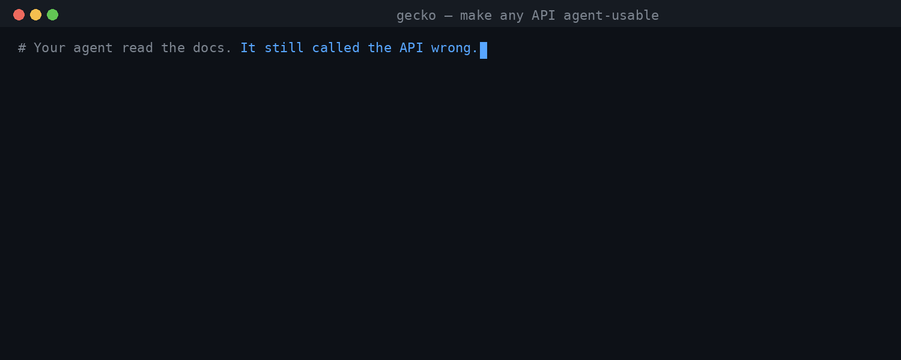
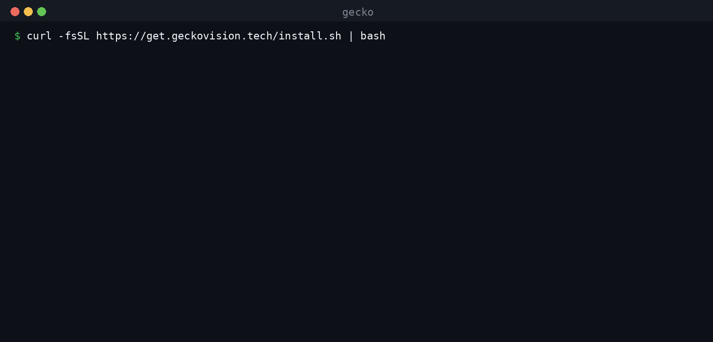
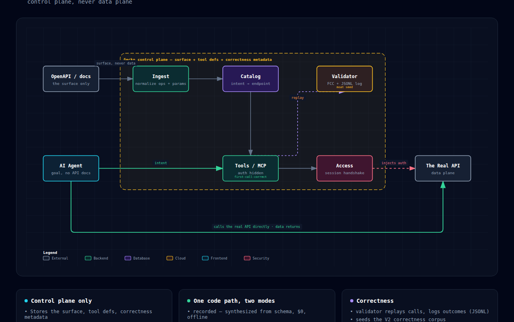

# gecko-surf — make any API agent-usable without integration code

<!-- mcp-name: tech.geckovision/surf -->

[](https://www.python.org/)
[](https://docs.astral.sh/uv/)
[](https://modelcontextprotocol.io/)
[](https://x402.org/)
[](LICENSE)
[](#development)

> **Agents one-shot clean APIs. They break on the painful ones** — messy, paywalled,
> half-documented, always drifting. Dumping the spec fails; hand-writing an MCP wrapper
> goes stale on the next API change.
>
> **Gecko turns an API into tools your agent calls right the first time — no integration
> code.** Point, add in one line, call the real API directly. Free and open source.
>
> *Docs are built for humans. Gecko translates them for agents.*

<p align="center">
  
</p>

---

## Table of Contents

- [Try it in 10 seconds](#try-it-in-10-seconds)
- [Open source engine, hosted platform](#open-source-engine-hosted-platform)
- [Watch it run](#watch-it-run)
- [What you'd actually type](#what-youd-actually-type)
- [Architecture](#architecture)
- [What you get](#what-you-get)
- [The surface graph](#the-surface-graph)
- [Make any API agent-usable](#make-any-api-agent-usable)
  - [Registry surfaces](#registry-surfaces)
- [Develop offline](#develop-offline)
- [Going live](#going-live)
- [What's in this repo](#whats-in-this-repo)
- [Stack](#stack)
- [Environment variables](#environment-variables)
- [Development](#development)
- [FAQ](#faq)
- [Contributing](#contributing)
- [Team](#team)
- [License](#license)

### Where Gecko sits — three verbs, three layers

| Layer | What it does | Who |
|---|---|---|
| APIs get **PAID** | billing / settlement rail | pay.sh |
| skills get **DISTRIBUTED** | marketplace / discovery | frames.ag, Bazaar |
| **APIs get USED** | **comprehension / consumption** | **Gecko** |

We compose on x402 / MCP / pay.sh. We are **not** a payment rail or a marketplace.

---

## Try it in 10 seconds

One line, zero install. No `pip`, no spec, no key — 18 first-call-correct tools on the
TxODDS TxLINE World Cup API (two-token on-chain paywall). **Recorded demo** (`$0`,
schema-synthesized); use your own TxLINE session for live data. Also live: **Jito** at
`/jito/mcp`, **Jupiter** at `/jupiter/mcp`.

```bash
claude mcp add --transport http gecko-txline https://mcp.geckovision.tech/txline/mcp
```

**Cursor / VS Code / any MCP client** — same endpoint in `mcp.json`:

```jsonc
{ "mcpServers": { "gecko-txline": { "type": "http", "url": "https://mcp.geckovision.tech/txline/mcp" } } }
```

Transport is **MCP Streamable HTTP** (`2025-11-25`), not SSE — use
`streamablehttp_client`, not `sse_client`. Ready for your own API?
→ [Make any API agent-usable](#make-any-api-agent-usable).

---

## Open source engine, hosted platform

You just used both. The endpoint above is **[mcp.geckovision.tech](https://mcp.geckovision.tech)**
— our hosted layer, running the exact engine in this repo.

This repository is the **open-source engine**: ingest, catalog, tool generation, the
surface graph, the anti-poisoning sanitizer, and the auth seam. Apache-2.0, patent grant
included, no feature gates. Clone it, embed the SDK, self-host the MCP server — that path
is complete and stays free.

The hosted platform is where an API stays live for agents without you operating anything:
comprehended surfaces served over Streamable-HTTP MCP, credentials injected at call time
(never in `mcp.json`), per-surface key gating for paid and private APIs, and
first-call-correctness suites that run against the surface as it drifts.

**Who pays:** API providers, to keep their surface live, correct, and agent-reachable —
a flat price per API, never a cut of your calls. **Developers never pay.** Gecko takes no
percentage, holds no funds, and settles nothing; when money moves it moves over x402
between the agent and the provider, and we are not in the path.

That split is the whole business model: the engine is open because distribution is the
point, and the hosted layer is what a provider buys.
→ [docs.geckovision.tech](https://docs.geckovision.tech)

---

## Watch it run

The 70-second launch demo:

<div align="center">



[MP4 version](docs/assets/launch.mp4)

</div>

Every number from a real run:

- **Plug in** TxODDS → **18 first-call-correct tools**, recorded/$0 first call (live when subscribed).
- **Stay safe** → poisoned-spec attacks that hit a naive agent **8/8** are blocked **0/8**.
- **Stay correct** → `gecko test` writes **32/32** first-call-correctness checks for CI.

---

## What you'd actually type

Gecko's surfaces take the question, not the endpoint. Once a surface is added, these are
literal prompts:

```
Which fixtures kick off in the next hour, and what are the current odds?
Get me live odds updates for tomorrow's Brazil match
What's the price of this token and its 24h volume?
Show me Jito's current tip floor before I send this bundle
```

The second one is the interesting case. `GET /api/odds/updates/{fixtureId}` needs a
`fixtureId` the agent doesn't have — so Gecko returns a **chain**, not a 404:

```
1. GET /api/fixtures/snapshot     # supplies fixtureId
2. GET /api/odds/updates/{fixtureId}
```

Onboarding your own API is the same shape — a sentence, not a config file:

```
/make-agent-ready https://api.example.com/openapi.json
```

```bash
gecko test https://api.example.com/openapi.json     # first-call-correctness suite
gecko from-docs https://docs.example.com/api        # no spec? recover a draft one
```

---

## Architecture

**Control plane, never data plane.** Gecko holds the API *surface*, tool defs, and
correctness metadata — never response payloads, user data, or secrets. That invariant
is what lets it ingest any API unilaterally.

<div align="center">



[Interactive diagram](docs/assets/architecture.html) · [SVG](docs/assets/architecture.svg)

</div>

1. **Ingest** — OpenAPI 3.x → normalized ops/params (never response data).
2. **Catalog** — intent → endpoint (lexical at this scale).
3. **Tools** — question-shaped defs; auth headers hidden.
4. **Access** — subscribe/session via one seam: `Session.auth_headers()`.
5. **Call** — agent hits the real API; Gecko injects credentials, stays off the data path.
6. **Validate** — replay, confirm first-call-correct, JSONL log → V2 correctness corpus seed.

---

## What you get

| Surface | Entry point | Status |
|---|---|---|
| **Serve any API to agents** (paste a spec → hosted MCP + one-click "add to Claude/Cursor") | `gecko serve <openapi-url>` (or bare `gecko <openapi-url>`) | shipped |
| **Generate + run first-call-correctness tests** (before any live call) | `gecko test <openapi-url> [-o test_api.py]` | shipped |
| **Recover a draft OpenAPI from human docs** (no spec? point it at the doc page) | `gecko from-docs <doc-url-or-path> [-o draft.json]` | shipped |
| **Embed the SDK** (`search / list_tools / prepare / call`) | `from gecko import AgentApiClient` | shipped |
| **Cross-API chains** (join two surfaces on a declared entity) | `gecko.compose.cross_plan` | shipped |
| **Forkable starter** (an app on any API, ~20 lines, $0) | `examples/_starter/` | shipped |
| **$0 recorded demo** (goal → discover → correct call → data, offline) | `python -m gecko.demo` | runnable now |
| **Live demo** against real TxODDS World Cup data | `gecko.demo:live_demo` (after subscribe) | mainnet-proven |
| **Correctness harness** (first-call-correct + flywheel log) | `gecko.validator` | shipped |

---

## The surface graph

Intent → the right *chain* of calls. Real questions rarely map to one endpoint.
*"Get live odds updates"* needs a `fixtureId` — so Gecko plans a chain from the spec
alone (no call logs, no training data):

```
agent intent: "get live odds updates"

plan:
  1. GET /api/fixtures/snapshot              # supplies fixtureId
  2. GET /api/odds/updates/{fixtureId}
explain:
  fixtureId ← FixtureId   [INFERRED · entity:fixture · high]
```

**Spec-derived** with provenance on every edge (`EXTRACTED` / `INFERRED` / `DECLARED`
plus confidence). Plans are suggestions — your agent still makes every call. Measured
offline: Stripe control cut false links **66,984 → 337** (−99.5%) while finding every
known chain on a paywalled API — see [docs/benchmarks.md](docs/benchmarks.md). On by
default in `search_capabilities`.

**Chains cross APIs too.** Two surfaces never merge into one graph; they join only on a
`DECLARED` entity the provider vouches for, so a name collision can't invent a link
between unrelated APIs —
[design](docs/specs/2026-07-19-surface-graph-correlations-design.md). What's next
(body-carried join keys, semantic tiebreak, live validation) is in the
[correlation roadmap](docs/specs/2026-07-22-correlation-roadmap.md).

---

## Make any API agent-usable

Point at an OpenAPI — no client code, auth handled, first call correct.

**A · Claude Code — Marketplace plugin** (skills + live demo surface):

```
/plugin marketplace add GeckoVision/gecko-surf
/plugin install gecko-surf@geckovision
/make-agent-ready https://api.example.com/openapi.json
```

Wires `gecko-txline` plus `/make-agent-ready`, `/setup-x402`, and anti-poisoning.

**B · Everywhere else — CLI** (Cursor, VS Code, any framework):

```bash
uvx --from "gecko-surf[serve]" gecko <openapi-url>
```

Prefer `uvx` (nothing to verify). Or prove the installer first with
[`scripts/verify_install.py`](scripts/verify_install.py), then
`curl -fsSL https://get.geckovision.tech/install.sh | bash`.

`gecko <url>` prints the MCP URL and one-click add links (Cursor / VS Code / raw).
**Claude Code → Marketplace; everything else → CLI.** You don't need both.

**Or embed the SDK:**

```python
from gecko import AgentApiClient, public_session

client = AgentApiClient(spec, session=public_session())
hit = client.search("what you want")[0]            # intent → right endpoint
client.call(hit["name"], {...}, mode="recorded")   # "live" for real data
```

Forkable starter: [`examples/_starter/`](examples/_starter/) (~20 lines, $0). Full
agent: [`examples/sos_vzla_bot/`](examples/sos_vzla_bot/).

### Registry surfaces

```bash
gecko serve --registry colosseum --auth-env COLOSSEUM_COPILOT_PAT
```

Free surfaces need no account. Premium: `GECKO_API_KEY` via
`POST /registry/keys` → OTP → `gk_live_...` (shown once; we store a salted hash).
Your provider key stays local — Gecko never sees it.

---

## Develop offline

$0, no keys, no subscription:

```bash
git clone https://github.com/GeckoVision/gecko-surf
cd gecko-surf && uv sync
uv run pytest                       # 1,630 passing
uv run python -m gecko.demo         # E2E: goal → discover → correct call → data (recorded, $0)
```

The recorded demo runs the **same code path** as live — it just synthesizes responses
from the schema instead of hitting the network. That's the point: you can falsify the
comprehension offline before spending a cent.

---

## Going live

Real World Cup data. Recorded mode needs no subscription. For live data, do the one-time
on-chain subscribe — see [`scripts/SUBSCRIBE.md`](scripts/SUBSCRIBE.md) — then pass a
real `Session`:

```python
from gecko.client import AgentApiClient
client = AgentApiClient(spec, base_url="https://...", session=my_session)
client.call(tool, args, mode="live")   # same path as recorded
```

> **Mainnet boundary:** the subscribe transaction is **founder-run only**. The tooling
> *simulates* (no spend) and hands over the exact command; a human broadcasts.

---

## What's in this repo

| Path | Purpose |
|---|---|
| `gecko/ingest.py` | OpenAPI 3.x → normalized `Operation`/`Param` (`$ref` resolution, guarded) |
| `gecko/catalog.py` | Lexical capability search (intent → endpoint) |
| `gecko/tools.py` | `Operation` → question-shaped agent tool defs (**auth hidden**) |
| `gecko/caller.py` | tool + args → correct `PreparedRequest` (stdlib `urllib`) |
| `gecko/graph.py` | The surface graph — entities, edges, provenance, chain planning |
| `gecko/compose.py` | Cross-API chains — per-surface graphs joined on `DECLARED` entities only |
| `gecko/sanitize.py` | Anti-poisoning — untrusted spec/doc text, fail-closed arg routing |
| `gecko/access.py` | `Session.auth_headers()` — the engine/adapter seam; two-token session |
| `gecko/sample.py` | deterministic schema → example (powers $0 recorded mode) |
| `gecko/client.py` | `AgentApiClient` — `search / list_tools / prepare / call` |
| `gecko/mcp_server.py` | `McpSurface` — the agent-facing MCP surface |
| `gecko/validator.py` | replay + first-call-correct + JSONL outcome log (moat seed) |
| `gecko/demo.py` | `run()` (recorded) + `live_demo()` |
| `gecko/serve.py` | `gecko <url>` CLI — comprehend + serve over Streamable-HTTP MCP (+ one-click add) |
| `examples/_starter/` | forkable "app on any API" (engine-only, $0); `examples/sos_vzla_bot/` is the full LLM agent |
| `scripts/subscribe.py` | one-time on-chain subscribe (solders); simulate by default |
| `docs/` · `private/` | strategy & PRD · gitignored business docs (canvas, pitch, numbers) |

**Rule:** the comprehension logic is the product and lives in `gecko/`. The MCP
server, the client, and scripts are thin transport.

---

## Stack

| Layer | Tool |
|---|---|
| Language | Python 3.11+, managed with `uv` |
| Engine | stdlib-first (`urllib`); minimal deps; `pyyaml` for spec loading |
| Agent surface | `mcp` (Model Context Protocol) |
| Access / payments | x402; on-chain subscribe via `solders`; modes `stub` / `live` |
| Quality | `ruff` · `mypy` · `pytest` (1,630 tests) |

---

## Environment variables

**Source of truth:** [`.env.example`](.env.example).

| Variable | Required | Default | Notes |
|---|---|---|---|
| `X402_MODE` | no | `stub` | `stub` / `live`. **Stub is intentional during user-testing — do not flip to live without founder go-ahead.** |
| `TXODDS_*` / session file | for live only | — | live World Cup access after the on-chain subscribe (see `scripts/SUBSCRIBE.md`) |

Recorded mode and the test suite need **no** keys.

---

## Development

```bash
uv run ruff format && uv run ruff check --fix
uv run mypy gecko
uv run pytest                       # 1,630 passing; targeted invocations preferred
uv run python -m gecko.demo         # $0 recorded smoke
```

See [`CLAUDE.md`](CLAUDE.md) for the architecture invariants, the subagent team, and
conventions.

---

## FAQ

### General

<details>
<summary><strong>Isn't this just a better MCP wrapper?</strong></summary>

A wrapper is a snapshot: someone hand-writes tool defs from a spec, and they go stale on
the next API change. Gecko is the generator, plus three things a wrapper doesn't have:
the **surface graph** (a question that needs two calls gets a chain with provenance, not
a 404), **anti-poisoning** (the spec is untrusted input, and a poisoned tool loses auth
injection), and the **auth seam** (credentials are injected at call time, so the tool def
never carries a key). Re-point at the spec and the tools regenerate; a wrapper needs a
human.

</details>

<details>
<summary><strong>Which APIs is this actually for?</strong></summary>

The painful ones. A coding agent already one-shots Stripe — it has seen Stripe a million
times. It does not one-shot a long-tail API with drifting docs, an odd auth handshake, or
a paywall in front of the spec. That's the wedge. If your agent already calls your API
correctly, you don't need Gecko.

</details>

<details>
<summary><strong>Does the agent call through Gecko?</strong></summary>

No. Gecko hands the agent a correct, credentialed request; the agent calls the API
directly. We are the control plane, never the data plane — see
[Architecture](#architecture).

</details>

<details>
<summary><strong>What if my API has no OpenAPI spec?</strong></summary>

`gecko from-docs <doc-url>` recovers a draft spec from human documentation. It's a draft
— review it, then feed it to `gecko serve`. If the docs are a JS-rendered SPA with no
embedded schema, it will honestly recover nothing rather than hallucinate endpoints.

</details>

### Install & use

<details>
<summary><strong>Do I need to install anything to try it?</strong></summary>

No. The [10-second quickstart](#try-it-in-10-seconds) points your MCP client at a hosted
surface. Installing (`uvx --from "gecko-surf[serve]" gecko <url>`) is only for
comprehending your *own* API.

</details>

<details>
<summary><strong>It's SSE vs Streamable HTTP — which one?</strong></summary>

Streamable HTTP (`2025-11-25`). Use `streamablehttp_client`, not `sse_client`. This is
the most common connection failure.

</details>

<details>
<summary><strong>Can I self-host instead of using mcp.geckovision.tech?</strong></summary>

Yes, and nothing is held back. `gecko serve <openapi-url>` runs the same server this repo
ships. The hosted layer saves you operating it; it doesn't unlock engine features.

</details>

<details>
<summary><strong>How do I test correctness before I trust it?</strong></summary>

`gecko test <openapi-url>` generates a first-call-correctness suite you can drop into CI,
and the `$0` recorded mode runs the identical code path offline. Falsify it before
spending a cent.

</details>

### Security & data

<details>
<summary><strong>Do you store my API responses or my users' data?</strong></summary>

No. Gecko stores the API *surface* — operations, params, generated tool defs, and
correctness metadata. Never response payloads, never user data, never secrets. It's an
architectural invariant, not a policy: the data plane never touches our storage.

</details>

<details>
<summary><strong>Where do my API keys live?</strong></summary>

Not in `mcp.json`. Credentials resolve through one seam (`Session.auth_headers()`) and
are injected at call time; the tool definitions the agent sees never contain them. For
self-hosting, your provider key stays on your machine.

</details>

<details>
<summary><strong>What happens if a spec is poisoned?</strong></summary>

Ingested spec and doc text is treated as untrusted input. The sanitizer scans for
prompt-injection and fund-routing patterns; a tool that trips it is quarantined
**per-tool** — it loses auth injection and cannot be called with credentials, while the
rest of the surface keeps working. Argument routing fails closed. The launch demo runs
8 attacks that land on a naive agent and are blocked 8/8.

</details>

<details>
<summary><strong>Can Gecko move funds or sign transactions?</strong></summary>

No. Gecko holds no funds, signs nothing, and takes no cut. The on-chain subscribe tooling
simulates by default and hands a human the exact command to broadcast.

</details>

### Commercial

<details>
<summary><strong>Is it really free? What's the catch?</strong></summary>

The engine is Apache-2.0 with a patent grant, no feature gates, and developers are never
charged. Revenue comes from API providers paying a flat price to keep their surface
hosted, correct, and agent-reachable. See
[Open source engine, hosted platform](#open-source-engine-hosted-platform).

</details>

<details>
<summary><strong>Do you take a cut of my API calls?</strong></summary>

Never. Flat pricing per API, no take-rate, no funds custody. When payment happens it goes
over x402 directly between the agent and the provider — we compose that rail, we are not
it.

</details>

<details>
<summary><strong>I'm an API provider. What do I get?</strong></summary>

Your API becomes reachable by agents that would otherwise call it wrong or not at all: a
hosted MCP surface, first-call-correctness suites that track your spec as it drifts, key
gating for paid or private endpoints, and the anti-poisoning layer in front of it. Your
own MCP server, if you have one, stays intact — we aggregate, we don't replace.
→ [docs.geckovision.tech](https://docs.geckovision.tech)

</details>

---

## Contributing

The engine is open because distribution is the point. See
[`CONTRIBUTING.md`](CONTRIBUTING.md) for setup, the mandatory gate
(`ruff` · `mypy` · `pytest` · `$0` demo), and the architectural ground rules — the
control-plane invariant, auth-injection, untrusted-spec handling, and no-SSRF are
enforced in review, not just style.

**Skills welcome.** `skills/` is the `gecko-surf` Claude Code plugin marketplace
(`use-any-api`, `read-js-docs`, `anti-poisoning`, `api-agent-ready`, `x402-payai-setup`).
Adding one is a `SKILL.md` plus a line in the plugin manifest — the contributing guide has
the details, including the rule that a skill points at engine code rather than restating it.

---

## Team

- **Ernani** ([@ernanibritto](https://x.com/ernanibritto)) — Technical co-founder.
  Builds the Gecko engine end-to-end: ingest, comprehension, the access layer, and
  the MCP surface.
- **Leticia** ([@0xLeti](https://x.com/0xLeti)) — Co-founder, Product Designer. 8+
  years designing for enterprises and startups; ex-Liga Ventures.

---

## License

**Apache License 2.0** — see [`LICENSE`](LICENSE) and [`NOTICE`](NOTICE). Apache-2.0 carries
an explicit patent grant. The engine is open (the distribution funnel); the correctness corpus
and hosted layer stay private (open-core).

---

*The comprehension layer for the agentic economy.*
