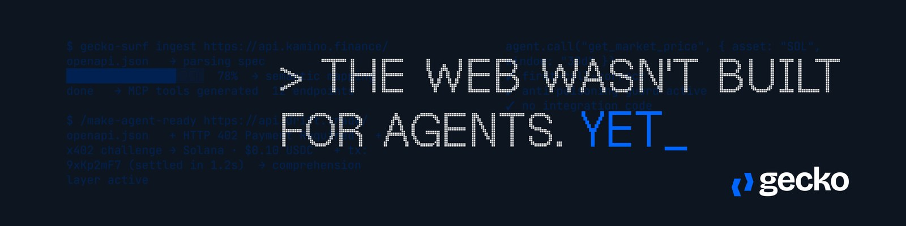
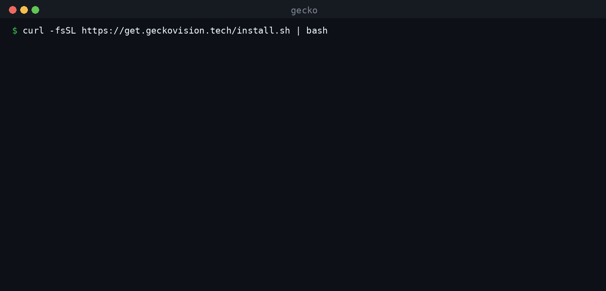
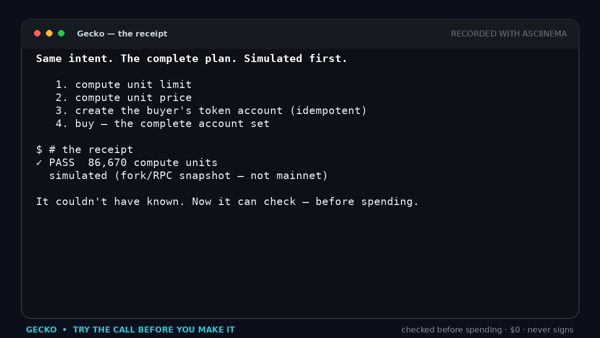
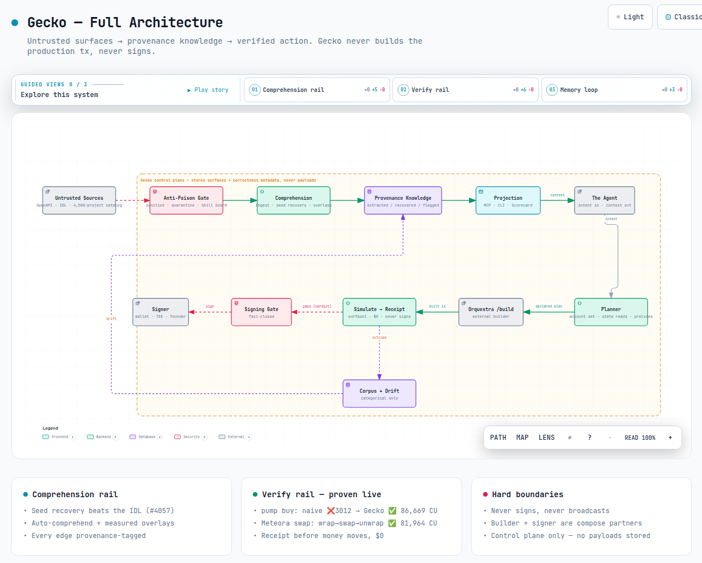

<p align="center">
  
</p>

<h1 align="center">The knowledge graph for APIs your agent can trust</h1>

<p align="center">
  Open-source. Runs on your machine. One command maps any API — even the messy, paywalled,<br>
  or on-chain ones — into a verified graph your agent <b>traverses instead of guessing</b>.<br>
  Every action can be simulated to a <b>receipt</b> before money moves.
</p>

<p align="center">
  <a href="https://www.python.org/"></a>
  <a href="https://modelcontextprotocol.io/"></a>
  <a href="#development"></a>
  <a href="LICENSE"></a>
  <a href="https://x402.org/"></a>
</p>

<p align="center">
  <a href="#quick-start"><b>Quickstart</b></a> ·
  <a href="https://docs.geckovision.tech"><b>Docs</b></a> ·
  <a href="docs/architecture.md"><b>Architecture</b></a> ·
  <a href="#faq"><b>FAQ</b></a> ·
  <a href="SECURITY.md"><b>Security</b></a>
</p>

<!-- mcp-name: tech.geckovision/surf -->

> **Built for the calls your agent must not get wrong.** Two axes, either one qualifies:
> a **messy surface** (paywalled, drifting, undocumented, on-chain) or a **high-stakes
> action** (your agent runs unattended with credentials or money).

## Quick start

No install:

```bash
npx @geckovision/gecko doctor              # 1. check your environment
npx @geckovision/gecko add <spec-or-docs>  # 2. comprehend it — $0, no live call
npx @geckovision/gecko report <spec>       # 3. get the scorecard — grade + findings
npx @geckovision/gecko serve <spec>        # 4. your agent uses it over MCP
```

Or install once:

```bash
npm install -g @geckovision/gecko          # prebuilt binary — no Python needed
uv tool install "gecko-surf[serve]"        # or pip, if you want the Python package

gecko add <spec-or-docs>
```

Plug into your agent:

```bash
# Claude Code
claude mcp add my-api -- npx -y @geckovision/gecko serve <spec> --stdio

# Cursor / VS Code / any MCP client — mcp.json
{ "mcpServers": { "my-api": { "command": "npx", "args": ["-y", "@geckovision/gecko", "serve", "<spec>", "--stdio"] } } }
```

Going live is a separate, deliberate step:

```bash
gecko auth set <provider>                  # key goes to your OS keychain — never mcp.json
```

Then your agent asks questions, not endpoints:

```
Which fixtures kick off in the next hour, and what are the current odds?
What is the peg state of USDC right now?
Plan a swap of SOL for USDC on Meteora, bin_step 4.
```

## Why

An OpenAPI says what exists. An IDL says what a program looks like. Neither is enough
to act:

- Docs drift. Working integrations broke twice in 2026 from silent layout changes.
- IDLs drop facts. A required Pump.fun account never appears in the IDL at all.
- Agents guess. A wrong guess posts a charge, reverts a transaction, burns fees.

Gecko replaces the guess with a graph:

- **Every edge carries provenance** — `extracted` from the surface, `recovered` from
  source, or honestly `flagged` as unknown. Never fabricated.
- **Every action can be verified first** — simulated on a $0 mainnet fork to a
  **receipt**: pass, or a classified revert, before any spend.
- **Every failure teaches** — outcomes land in a categorical corpus; a drift series
  flags when a provider ships a change that breaks a working call.
- **Auth is invisible to the agent** — keys injected at call time from your keychain.
  The model never sees a credential.

## Under the hood

Most agent-tool layers are thin wrappers. Gecko is a memory substrate, and three of
its design choices are deliberately different from the textbook:

| Choice | Why it matters |
|---|---|
| **Deterministic semantic memory** — lexical retrieval, no vector DB | the graph never "approximately" remembers; BM25 and vectors sit behind evidence gates |
| **Self-generated episodic memory** — categorical outcomes + a drift series | Gecko re-simulates to create its own episodes; no dependence on your data plane, no payloads stored |
| **Typed procedural memory** — plans as executable JSON | landing plans and derive orders a builder can run; text loses the join, ours can't |

And the depth is measured, not asserted:

- **The overlay artifact.** For every auto-comprehended program, Gecko emits the exact
  list of facts that could **not** be derived from any public surface
  ([`overlays/`](gecko/providers/configs/orquestra/overlays/)) — the value of
  comprehension, quantified per program.
- **Seven security layers, fail-closed:** spec sanitizer · per-tool quarantine · image
  Skill Guard · SSRF netguard · out-of-band auth anchoring · verdict signing gate · an
  AST-enforced never-sign boundary.
- **The numbers:** 2,400+ tests · 4 mainnet programs derivation-proven · 2 live
  receipt-pairs · −77%/−89% measured context cuts · a 4,500-program catalog listed ·
  0 auth headers exposed across 14 real specs.

**Explore it interactively:** [full pipeline](docs/assets/architecture.html) ·
[context engineering](docs/assets/architecture-context.html) ·
[the on-chain loop](docs/assets/architecture-onchain.html) · [the map](docs/architecture.md)

## Proof, not promises

Live, on a mainnet fork, $0:

| Case | Naive path | Gecko |
|---|---|---|
| Pump.fun buy | ❌ reverts — `AccountNotInitialized (3012)` | ✅ lands — 86,669 CU |
| Pump.fun sell | ❌ transfers the tokens, then reverts — `InvalidBondingCurveV2 (6074)` | ✅ lands — 50,783 CU |
| Meteora DLMM swap | ❌ reverts — derive-only, no ATA/wrap/bin-array preludes | ✅ wrap → swap → unwrap — 81,964 CU |
| Meteora pool derivation | ❌ stale 3-seed scheme → the wrong pool, silently | ✅ correct 4-seed derivation, differential-proven |
| Docs-only API (no spec) | agent invents endpoints | ✅ draft spec recovered, verified `VERIFIED/REFUTED` |

The facts behind those passes are not on any surface: a 4th PDA seed the SDK added in
2024, an account the IDL only mentions in prose, a fee field resolved by a refuting
simulation. That is the graph your agent traverses.

## Use cases

**TxLINE (paywalled sports odds) — without vs with Gecko**

 · [MP4](docs/assets/launch.mp4)

**Cross-API correlation — three APIs, one question**

Pegana × Birdeye × Jupiter joined on a declared entity; the agent plans across
surfaces first-try. Try it: `gecko graph svg <spec>` renders any surface's call graph.

**Solana programs — try the call before you make it**

<p align="center">
  
</p>

[▶ watch the 43s demo](docs/assets/onchain-receipt.mp4) — a coding assistant builds the
call by itself and can only find out by trying. Same intent through Gecko: the complete
plan, every account tagged with where it came from, simulated to a **passing receipt for
$0** before anything is spent.

```bash
uvx --from "gecko-surf[serve,solana]" gecko-orquestra --program pumpfun --stdio
```

Gecko recovers the seeds the IDL drops, plans the full instruction, Orquestra builds
it, and the receipt says whether it lands — before any signature.

## Architecture

<p align="center">
  
</p>

**Control plane, never data plane.** Gecko stores surfaces + correctness metadata —
never response payloads, user data, or secrets.

1. **Ingest** — OpenAPI / docs / IDL / program source → sanitized, quarantine-checked.
2. **Comprehend** — normalized ops, recovered PDA seeds, generated configs + measured
   overlays.
3. **Know** — the provenance graph (surface, program, cross-API joins).
4. **Project** — question-shaped tools over MCP; auth stripped; −77%/−89% context cuts
   measured on two real specs.
5. **Verify** — plan → external builder → simulate → **receipt** → fail-closed signing
   gate. Gecko never signs, never broadcasts.
6. **Learn** — categorical outcomes → drift series → back into the graph.

[Interactive diagrams](docs/architecture.md) · [llms.txt](architecture.llms.txt) ·
[Receipt semantics](docs/receipt.md)

## What you get

| Capability | Entry point |
|---|---|
| Serve any API to agents over MCP | `gecko serve <spec>` |
| Scorecard: grade + fixable findings + Playground | `gecko report <spec>` |
| Recover a draft spec from human docs | `gecko from-docs <url>` |
| First-call-correctness tests for CI | `gecko test <spec>` |
| The surface graph, rendered | `gecko graph svg <spec>` |
| Program Surface: recovered seeds + derive plans | `gecko orquestra --program <name>` |
| find_start: intent → the right starting instruction | `gecko orquestra find-start "..."` |
| Simulate → receipt on a built transaction | `gecko/simulate.py` (engine) |
| Embed the SDK | `from gecko import AgentApiClient` |
| Verify docs claims against reality | `gecko verify-docs <spec>` |
| Scan a skill image for hidden payloads | `gecko scan-image <path>` |

## Modes

- **Recorded** (default): $0, schema-synthesized responses, fully offline. Falsify
  everything before any live call.
- **Live**: same code path; credentials injected from your keychain at the edge.
  `gecko auth set <provider>` — deliberate, never implicit.

## Hosted

The engine in this repo also runs at [mcp.geckovision.tech](https://mcp.geckovision.tech)
— comprehended surfaces served over Streamable-HTTP MCP, keys injected server-side.
Developers never pay; providers pay a flat price per API.
Gecko takes no cut, holds no funds, signs nothing.
→ [docs.geckovision.tech](https://docs.geckovision.tech)

## Repo map

| Path | What |
|---|---|
| `gecko/` | the engine — ingest, catalog, tools, graphs, simulate, corpus |
| `gecko/providers/` | program surfaces (Meteora, Pump.fun, ORE, MetaDAO) + configs |
| `scripts/`, `gecko/cli.py` | thin transport — parse, call the package, format |
| `docs/` | architecture, receipt semantics, specs, benchmarks |
| `examples/` | forkable starters |

## Development

```bash
uv run ruff format && uv run ruff check --fix
uv run mypy gecko
uv run pytest                # 2,400+ passing
uv run python -m gecko.demo  # $0 recorded E2E
```

<details>
<summary><b>FAQ</b></summary>

**Is this a tool-generation wrapper?** No. Tool generation is the table stakes. The
product is the verified graph (provenance on every edge), the receipt (simulate before
money moves), and the drift series (know when a provider breaks you).

**Who is it for?** Two axes — either one qualifies: a messy surface (paywalled,
drifting, undocumented, on-chain), or a high-stakes action (your agent runs unattended
with credentials or money). Clean API + a human reviewing the diff? You may not need us
— and that's fine.

**Does Gecko sign or hold funds?** Never. Gecko never signs, never broadcasts, never
builds the production transaction — sim-only unsigned assembly is the documented
carve-out, AST-enforced at the sign/send boundary. Building belongs to builders
(e.g. Orquestra), signing to signers (wallet / TEE / you).

**What does Gecko store?** Surfaces and correctness metadata. Never payloads, balances,
pubkeys-in-outcomes, or secrets. The corpus is categorical, closed-vocabulary, audited.

**Vector database?** No — retrieval is lexical and deterministic (token-overlap; BM25
and semantic tiers both sit behind evidence gates that flip only on measured recall
failure — including one measured negative result on embeddings).

**Is it free?** The engine is Apache-2.0, complete, self-hostable. The hosted layer is
what an API provider buys. Developers never pay.

</details>

## Contributing

PRs welcome. Run the toolchain above before pushing. Security findings →
[SECURITY.md](SECURITY.md).

## License

Apache-2.0 — see [LICENSE](LICENSE).
