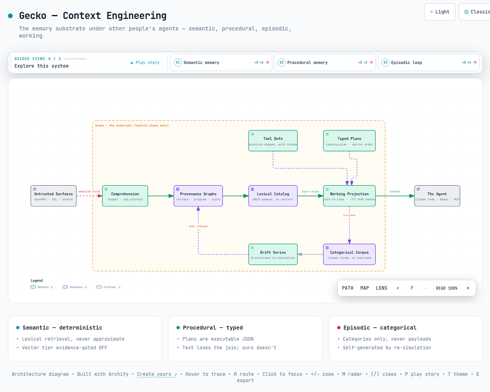
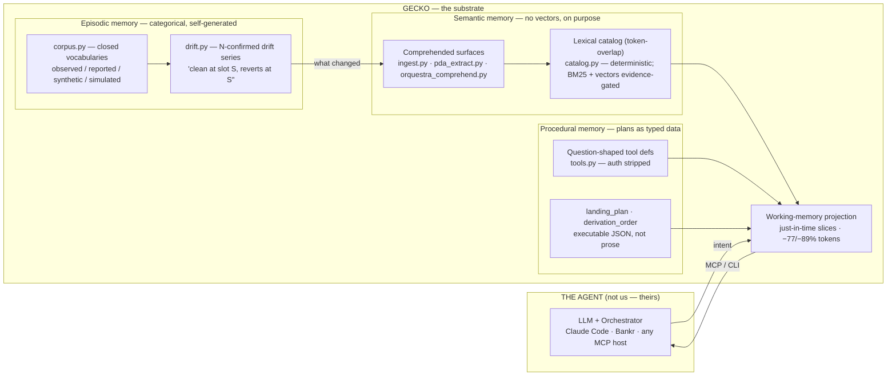
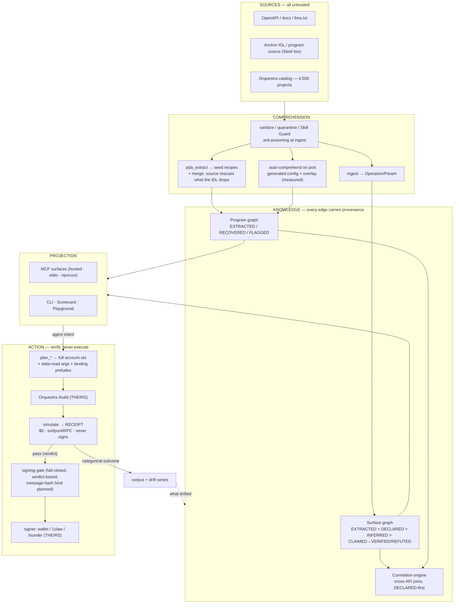
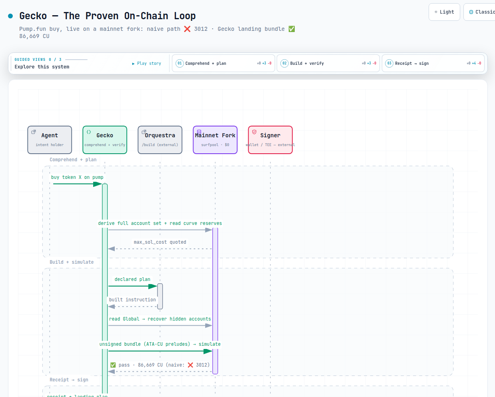
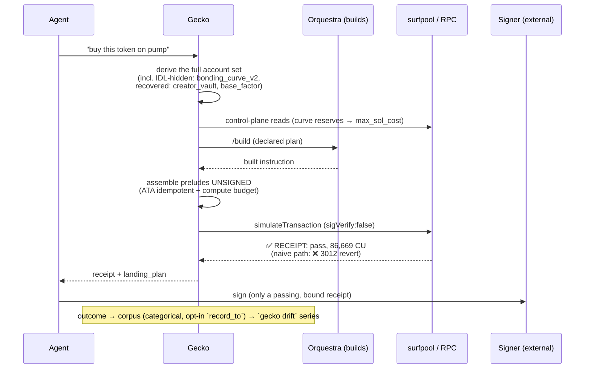

# Gecko architecture

> The three views, with interactive versions and the agent-readable summary:
> [full pipeline (interactive)](assets/architecture.html) ·
> [context engineering (interactive)](assets/architecture-context.html) ·
> [the on-chain loop (interactive)](assets/architecture-onchain.html) ·
> [architecture.llms.txt](../architecture.llms.txt)

# Gecko — the architecture, in three views

> The knowledge graph for APIs your agent can trust. Open-source, runs on your machine.
> One command maps any API — even the messy, paywalled, or on-chain ones — into a
> verified graph your agent **traverses instead of guessing**, and every action can be
> simulated to a **receipt** before money moves. This page: how it's built, what's
> proven, and what isn't yet.

---

## View 1 — Context engineering (the memory substrate)

Gecko is **not the agent** — it is the memory-and-context substrate *under* other
people's agents. Every block of the canonical agent-memory architecture exists here,
and the three that differ from the textbook are the product.

**The three deliberate differences:** semantic memory that never *approximately*
remembers (lexical, evidence-gated against vectors) · episodic memory that stores
**categories, never payloads** — and generates its own episodes by re-simulating ·
procedural memory as **typed plans** a builder can execute, not text an LLM re-reads.

---

## View 2 — The full architecture (sources → knowledge → action)

**The hard boundaries:** Gecko never signs, never broadcasts, never proxies the data
plane (control-plane invariant: surfaces + correctness metadata, never payloads).
Building and signing belong to compose partners — that is the design, not a gap.

---

## View 3 — The on-chain action path (the proven loop)

Live, verbatim: **pump buy** — naive ❌ `account_error (3012)` → Gecko bundle ✅
`pass, 86,669 CU`. **Meteora swap** — wrap → swap across live bins → unwrap, ✅
`81,964 CU`. Both at $0, before any spend.

---

## What's WORKING (proven) vs NOT BUILT yet

| Layer | ✅ Working & proven | 🚧 Not built yet |
|---|---|---|
| **Comprehension** | OpenAPI + docs ingest · anti-poison quarantine · Skill Guard (image/encoded) · PDA recovery (Anchor + Steel source) · auto-comprehend w/ measured overlays (4 programs, differential-proven) | catalog breadth (4,500 projects listed, 4 wired) · non-Anchor beyond ORE |
| **Knowledge** | surface graph + VERIFIED/REFUTED · program graph + FLAGGED honesty · cross-API correlation (DECLARED-first) · one unified provenance module (`gecko/provenance.py`) | semantic tier (evidence-gated OFF) |
| **Projection** | hosted + local MCP · question-shaped tools, auth invisible · scale-adaptive listing (defs on demand) · −77%/−89% context cuts (two real specs) · Scorecard/Playground · `find_start` intent router | public-docs refresh |
| **Action/verify** | simulate→Receipt (pump + Meteora live proofs) · landing preludes · state-read args · never-sign AST boundary | pump `sell` round-trip · ORE claim / MetaDAO fund intents · hosted point-&-simulate |
| **Memory** | categorical corpus (4 tiers) · N-confirmed drift detector · guarded recipe_hash · opt-in `record_to` wiring on the landing orchestrators + `gecko drift` reader | drift **scheduler** (cadence) · cross-customer pooling (consent-gated) |
| **Security** | SSRF netguard · auth firewall (out-of-band anchor) · keyring/pointer secrets · signing gate v1 | `evaluate_tx` message-hash binding · 1claw TEE credential backend · x402 live billing |

*Honest one-liner: the engine and the proofs are real; the breadth (catalog scale), the
cadence (drift scheduler), and the payer (WTP) are the open frontier.*
